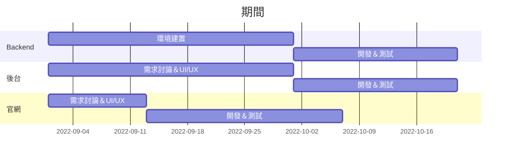

First Side Project !!
===


## Table of Contents

[TOC]

## Git-Repo setting

使用 ssh-key 來 commit & push Project

1. 產生 ssh-key
2. 測試 github 的連線 $ssh -T git@github.com
3. 給我 ~/.ssh/id_rsa.pub (公鑰)
4. git clone project with ssh-key

User Story
---

```gherkin=
Feature: Guess the word

  # The first example has two steps
  Scenario: Maker starts a game
    When the Maker starts a game
    Then the Maker waits for a Breaker to join

  # The second example has three steps
  Scenario: Breaker joins a game
    Given the Maker has started a game with the word "silky"
    When the Breaker joins the Maker's game
    Then the Breaker must guess a word with 5 characters
```
> I choose a lazy person to do a hard job. Because a lazy person will find an easy way to do it. [name=Bill Gates]


```gherkin=
Feature: Shopping Cart
  As a Shopper
  I want to put items in my shopping cart
  Because I want to manage items before I check out

  Scenario: User adds item to cart
    Given I'm a logged-in User
    When I go to the Item page
    And I click "Add item to cart"
    Then the quantity of items in my cart should go up
    And my subtotal should increment
    And the warehouse inventory should decrement
```

> Read more about Gherkin here: https://docs.cucumber.io/gherkin/reference/


Project Timeline
---


> Read more about mermaid here: http://mermaid-js.github.io/mermaid/

## Appendix and FAQ

:::info
**Find this document incomplete?** Leave a comment!
:::

###### tags: `Templates` `Documentation`
